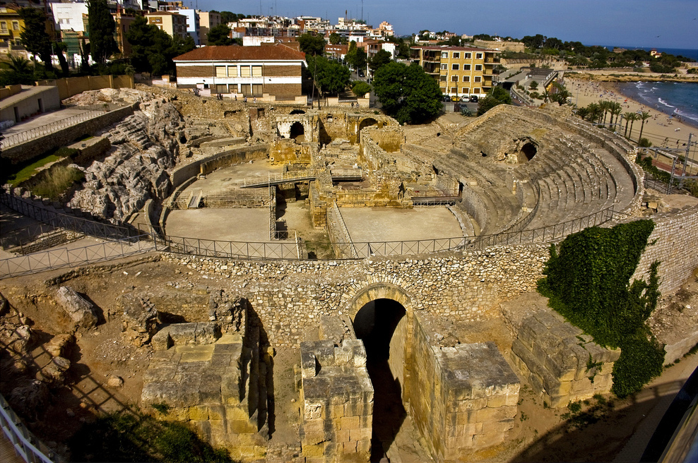

```{r setup, include=FALSE}
knitr::opts_chunk$set(echo = TRUE)
```

## Título del dataset 

Patrimonios de la Humanidad en España

## Descripción

El conjunto de datos generado reúne diferentes características de los distintos Patrimonios de la Humanidad en España desde 1984,cuando se incorporaron a la lista de bienes Patrimonio de la Humanidad los primeros cinco bienes culturales situados en España. Las variables que se recogen en el conjunto de datos son el nombre del Patrimonio, el tipo de bien, su localización y el año en el que fueron inscritos.

## Imagen identificativa

{width=50%}

\newpage

## Contexto

Como se ha comentado, la materia del conjunto de datos se corresponde con todos los Patrimonios de la Humanidad en España. Para ello se ha utilizado la información del siguiente artículo de Wikipedia, [Anexo:Patrimonio de la Humanidad en España](https://es.wikipedia.org/wiki/Anexo:Patrimonio_de_la_Humanidad_en_Espa%C3%B1a), que presenta los distintos Patrimonios junto a su localización y fecha de inscripción.

## Contenido

Cada registro en el conjunto de datos recoge las siguientes características:

* **Tipo**: el tipo de bien al que pertenece el monumento. Puede ser bienes culturales, naturales, mixtos o inmateriales.  
* **Año**: año en el que fue inscrito el Patrimonio o sufrió una extensión.
* **Nombre**: nombre del Patrimonio de la Humanidad.
* **Localización**: el nombre de la comunidad autónoma donde se encuentra el Patrimonio.

Debido a que hay patrimonios localizados en varias Comunidades Autónomas o patrimonios que han recibido extensiones en años posteriores, como es el caso del Camino de Santiago. Dichos patrimonios tienen un registro por cada comunidad en la que se encuentra localizado y por el año de registro y de extensión, si se da el caso.

Los datos han sido recogidosdel artículo de Wikipedia "Anexo:Patrimonio de la Humanidad en España",  (https://es.wikipedia.org/wiki/Anexo:Patrimonio_de_la_Humanidad_en_Espa%C3%B1a). Presenta todos los Patrimonios de la Humanidad desde 1984, cuando se incorporaron a la lista de bienes Patrimonio de la Humanidad los primeros cinco bienes culturales situados en España.

## Agradecimientos

Los datos han sido recolectados desde el siguiente artículo de Wikipedia, [Anexo:Patrimonio de la Humanidad en España](https://es.wikipedia.org/wiki/Anexo:Patrimonio_de_la_Humanidad_en_Espa%C3%B1a). Para ello, se ha hecho uso de técnicas de *Web Scraping* para extraer la información alojada en las páginas HTML mediante el uso del lenguaje de programación de Python.

## Inspiración


## Licencia

La licencia escogida para la publicación de este conjunto de datos ha sido **CC0: Public Domain License**, lo que dedica la obra al dominio público, mediante la renuncia todos sus derechos a la obra bajo las leyes de derechos autorales en todo el mundo, incluyendo todos los derechos conexos y afines, en la medida permitida por la ley.

Además, la obra puede ser copiada, modificada, distribuida e interpretada, incluso para propósitos comerciales, sin pedir permiso. Lo que permite su uso tanto para fines educativos como comerciales e incrementen las probabilidades del uso ajeno para su posterior interpretación o modificación.


## Código fuente y dataset

Tanto el código en Python como el dataset en formato CSV (separado con ',') generado pueden ser accedidos a través de [este enlace](https://github.com/BaltiBoix/ciclovida_PAC1.git).

## Contribuciones

| Contribuciones                   | Firma  |
|----------------------------------|--------|
| Investigación previa             |        | 
| Redacción de las respuestas      |        |
| Desarollo código                 |        |
