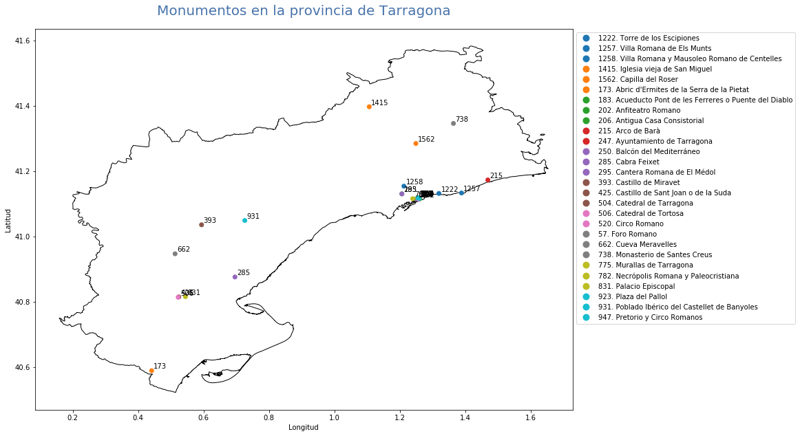

```{r setup, include=FALSE}
knitr::opts_chunk$set(echo = TRUE)
```

## Título del dataset 

Monumentos de España.

## Descripción

El conjunto de datos generado reúne diferentes características de los 1599 monumentos que se pueden encontrar en todo el territorio español. Las variables que se recogen en el conjunto de datos incluyen el nombre de los monumentos, así como y la comunidad autónoma, provincia y municipio donde se encuentran, junto con una breve descripción de cada monumento.

## Imagen identificativa

{width=50%}

\newpage

## Contexto

Como se ha comentado, la materia del conjunto de datos se corresponde con todos los monumentos de España. Entre ellos pueden encontrarse monumentos naturales como la Cueva de Ekain o la Cueva de don Juan o monumentos culturales como el Anfiteatro romano de Tarragona.

## Contenido

Cada registro en el conjunto de datos recoge las siguientes características:

* **Id**: el número de identificacion del monumento.  
* **Name**: el nombre del monumento.
* **href**: la referencia a la página de internet del monumento.
* **Comunidad**: comunidad autónoma donde se encuentra el monumento.
* **Provincia**: provincia donde se encuentra el monumento.
* **Municipio**: municipio donde se encuentra el monumento.
* **Descripcion**: una breve descripción del monumento.
* **direccion**: la dirección del monumento.
* **latitude**: la latitud del monumento.
* **longitude**:la longitud del monumento.

Los datos han sido recogidos del Portal oficial de turismo de España , (https://www.spain.info/es/consulta/monumentos-historicos-espana/). Presenta todos los monumentos de España, junto con su localización y una breve descripción de cada monumento.

## Agradecimientos

Los datos han sido recolectados desde el [Portal oficial de turismo de España](https://www.spain.info/es/consulta/monumentos-historicos-espana/). Para ello, se ha hecho uso de técnicas de *Web Scraping* para extraer la información alojada en las páginas HTML mediante el uso del lenguaje de programación de Python.

## Inspiración

España es un país cuya economía está altamente ligada al turismo. Además, es un país con muchos monumentos tanto históricos como naturales lo que genera mucho turismo a nivel nacional. En total, el turismo cultural realizado por viajeros españoles genera unos 2.484 millones de euros al año. (Ver [Andalucía y Catalunya lideran el ránking de gastos de turismo cultural](https://www.hosteltur.com/70627_andalucia-catalunya-lideran-ranking-gasto-turismo-cultural.html)).

El presente conjunto de datos podría utilizarse en ámbitos turísticos, ya que puede ser utilizado para generar mapas acordes a los intereses del turista. Con el conjunto de datos se pueden generar mapas de las comunidades o provincias que se quieran visitar y seleccionar los monumentos en los que se esté más interesado para hacer rutas turísticas. A continuación, se presenta un ejemplo de todos los monumentos en la provincia de Tarragona.

{width=50%}

\newpage

## Licencia

La licencia escogida para la publicación de este conjunto de datos ha sido **CC0: Public Domain License**, lo que dedica la obra al dominio público, mediante la renuncia todos sus derechos a la obra bajo las leyes de derechos autorales en todo el mundo, incluyendo todos los derechos conexos y afines, en la medida permitida por la ley.

Además, la obra puede ser copiada, modificada, distribuida e interpretada, incluso para propósitos comerciales, sin pedir permiso. Lo que permite su uso tanto para fines educativos como comerciales e incrementen las probabilidades del uso ajeno para su posterior interpretación o modificación.


## Código fuente y dataset

Tanto el código en Python como el dataset en formato CSV (separado con ',') generado pueden ser accedidos a través de [este enlace](https://github.com/BaltiBoix/ciclovida_PAC1.git).

## Contribuciones

| Contribuciones                   |          Firma              |
|----------------------------------|-----------------------------|
| Investigación previa             |Baltasar Boix  y Yago Ezcurra| 
| Redacción de las respuestas      |Baltasar Boix  y Yago Ezcurra| 
| Desarollo código                 |Baltasar Boix  y Yago Ezcurra| 
